# Neural Architecture Search with Random Labels(RLNAS)

## Introduction
This project provides an implementation for [Neural Architecture Search with Random Labels](https://arxiv.org/abs/2101.11834) (CVPR 2021 poster) on Pytorch. Experiments are evaluated on multiple datasets (NAS-Bench-201 and ImageNet) and multiple search spaces (DARTS-like and MobileNet-like). RLNAS achieves comparable or even better results compared with state-of-the-art NAS methods such as PC-DARTS, Single Path One-Shot, even though the counterparts utilize full ground truth labels for searching. We hope our finding could inspire new understandings on the essential of NAS.

## Requirements
* Pytorch 1.4
* Python3.5+

## Search results
### 1.Results in NAS-Benchmark-201 search space

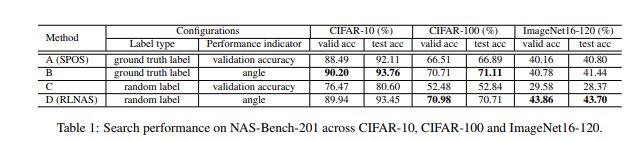

### 2.Results in DARTS searh space

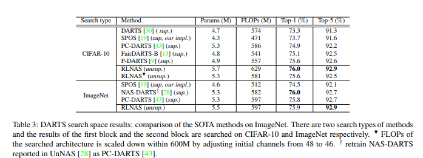

### Architeture visualization
#### 1) Architecture searched on CIFAR-10

* RLDARTS = Genotype( <br>
          normal=[  <br>
             ('sep_conv_5x5', 0), ('sep_conv_3x3', 1), <br>
             ('dil_conv_3x3', 0), ('sep_conv_5x5', 2), <br>
             ('sep_conv_3x3', 0), ('dil_conv_5x5', 3), <br> ('dil_conv_5x5', 1), ('dil_conv_3x3', 2)],
          normal_concat=[2, 3, 4, 5], <br>
          reduce=[ <br>
             ('sep_conv_5x5', 0), ('dil_conv_3x3', 1), <br>
             ('sep_conv_3x3', 0), ('sep_conv_5x5', 2), <br>
             ('dil_conv_3x3', 1), ('sep_conv_3x3', 3), <br>
             ('max_pool_3x3', 1), ('sep_conv_5x5', 2,)], <br>
          reduce_concat=[2, 3, 4, 5])


* Normal cell:
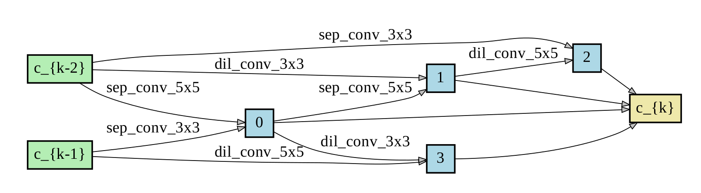

* Reduction cell:
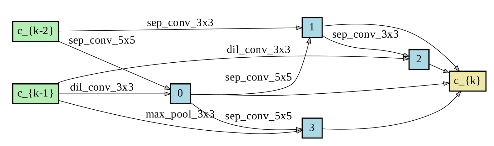


#### 2) Architecture searched on ImageNet-1k without FLOPs constrain

* RLDARTS = Genotype(
          normal=[<br>
              ('sep_conv_3x3', 0), ('sep_conv_3x3', 1),  <br>
              ('sep_conv_3x3', 1), ('sep_conv_3x3', 2),  <br>
              ('sep_conv_3x3', 0), ('sep_conv_5x5', 1),  <br>
              ('sep_conv_3x3', 0), ('sep_conv_3x3', 1)], <br>
          normal_concat=[2, 3, 4, 5],                    <br>
          reduce=[<br>
              ('sep_conv_3x3', 0), ('sep_conv_3x3', 1), <br>
              ('sep_conv_5x5', 0), ('sep_conv_3x3', 2), <br>
              ('sep_conv_5x5', 0), ('sep_conv_5x5', 2), <br>
              ('sep_conv_3x3', 2), ('sep_conv_3x3', 4)], <br>
          reduce_concat=[2, 3, 4, 5])

* Normal cell:
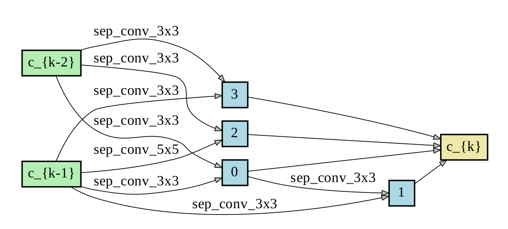

* Reduction cell:
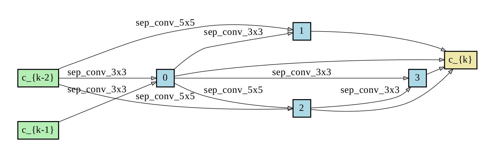

#### 3) Architecture searched on ImageNet-1k with 600M FLOPs constrain

* RLDARTS = Genotype(  <br>
          normal=[   <br>
              ('sep_conv_3x3', 0), ('sep_conv_3x3', 1),  <br>
              ('skip_connect', 1), ('sep_conv_3x3', 2),  <br>
              ('sep_conv_3x3', 1), ('sep_conv_3x3', 2),  <br>
              ('skip_connect', 0), ('sep_conv_3x3', 4)], <br>
              normal_concat=[2, 3, 4, 5], <br>
          reduce=[
          ('sep_conv_3x3', 0), ('max_pool_3x3', 1),  <br>
          ('sep_conv_3x3', 0), ('skip_connect', 1),  <br>
          ('sep_conv_3x3', 0), ('dil_conv_3x3', 1),  <br>
          ('skip_connect', 0), ('sep_conv_3x3', 1)], <br>
          reduce_concat=[2, 3, 4, 5])


* Normal cell:
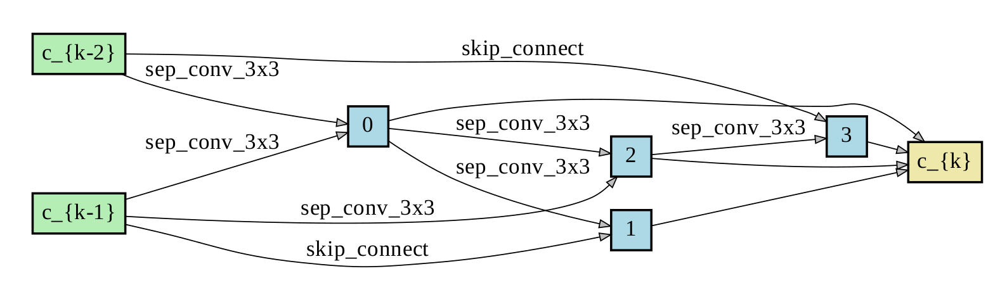

* Reduction cell:
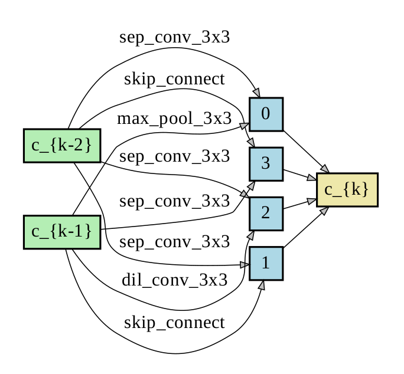

### 3.Results in MobileNet search space

The MobileNet-like search space proposed in ProxylessNAS is adopted in this paper. The SuperNet contains 21 choice blocks and each block has 7 alternatives:6 MobileNet blocks (combination of kernel size {3,5,7} and expand ratio {3,6}) and ’skip-connect’.

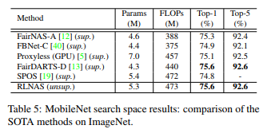

### Architeture visualization
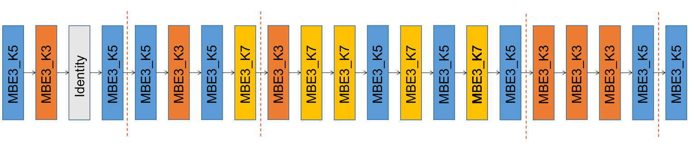


## Usage
* RLNAS in NAS-Benchmark-201

1)enter the work directory
```shell
cd nas_bench_201
```
2)train supernet with random labels
```shell
bash ./scripts-search/algos/train_supernet.sh cifar10 0 1
```
3)evolution search with angle
```shell
bash ./scripts-search/algos/evolution_search_with_angle.sh cifar10 0 1
```
4)calculate correlation
```shell
bash ./scripts-search/algos/cal_correlation.sh cifar10 0 1
```
5)evalutate the robustness of architecture transfer (angle v.s. accuracy, the high-lighted point is the architecture w/ top angle)
```shell
bash ./scripts-search/algos/transfer_robustness.sh cifar10 0 1
```
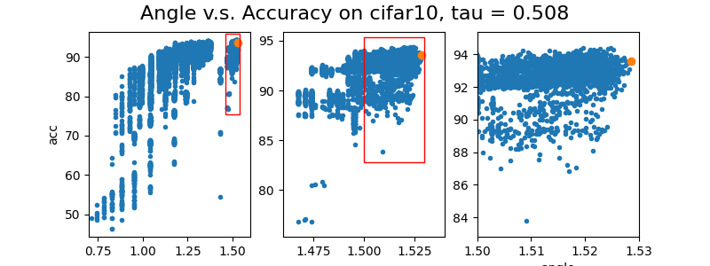
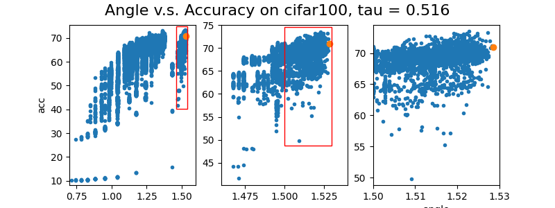
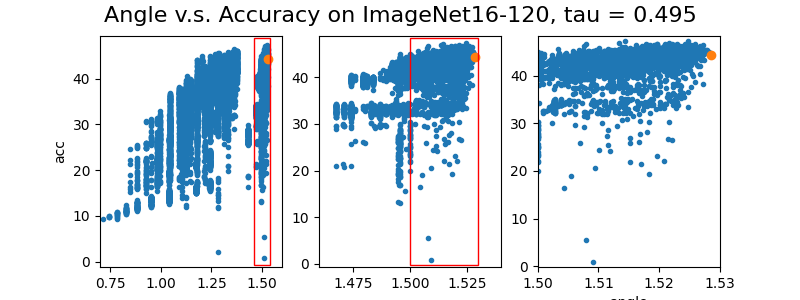

* RLNAS in DARTS search space

1)enter the work directory
```shell
cd darts_search_space
```
search architecture on CIFAR-10
```shell
cd cifar10/rlnas/
```
or search architecture on ImageNet
```shell
cd imagenet/rlnas/
```

2)train supernet with random labels
```shell
cd train_supernet
bash run_train.sh
```
3)evolution search with angle
```shell
cd evolution_search
cp ../train_supernet/models/checkpoint_epoch_50.pth.tar ./model_and_data/
cp ../train_supernet/models/checkpoint_epoch_0.pth.tar ./model_and_data/
bash run_server.sh
bash run_search.sh
```
4)architeture evaluation
```shell
cd retrain_architetcure
```
add searched architecture to genotypes.py
```shell
bash run_retrain.sh
```

* RLNAS in MobileNet search space

The conduct commands are almost the same steps like RLNAS in DARTS search space, excepth that you need run 'bash run_generate_flops_lookup_table.sh' before evolution search.

Note: setup a server for the distributed search
```shell
tmux new -s mq_server
sudo apt update
sudo apt install rabbitmq-server
sudo service rabbitmq-server start
sudo rabbitmqctl add_user test test
sudo rabbitmqctl set_permissions -p / test '.*' '.*' '.*'
```

Before search, please modify host and username in the config file evolution_search/config.py.

## Citation
If you find that this project helps your research, please consider citing some of the following papers:

```
@article{zhang2021neural,
  title={Neural Architecture Search with Random Labels},
  author={Zhang, Xuanyang and Hou, Pengfei and Zhang, Xiangyu and Sun, Jian},
  booktitle={Proceedings of the IEEE conference on computer vision and pattern recognition},
  year={2021}
}
```

```
@inproceedings{hu2020angle,
  title={Angle-based search space shrinking for neural architecture search},
  author={Hu, Yiming and Liang, Yuding and Guo, Zichao and Wan, Ruosi and Zhang, Xiangyu and Wei, Yichen and Gu, Qingyi and Sun, Jian},
  booktitle={European Conference on Computer Vision},
  pages={119--134},
  year={2020},
  organization={Springer}
}
```

```
@inproceedings{guo2020single,
  title={Single path one-shot neural architecture search with uniform sampling},
  author={Guo, Zichao and Zhang, Xiangyu and Mu, Haoyuan and Heng, Wen and Liu, Zechun and Wei, Yichen and Sun, Jian},
  booktitle={European Conference on Computer Vision},
  pages={544--560},
  year={2020},
  organization={Springer}
}
```
